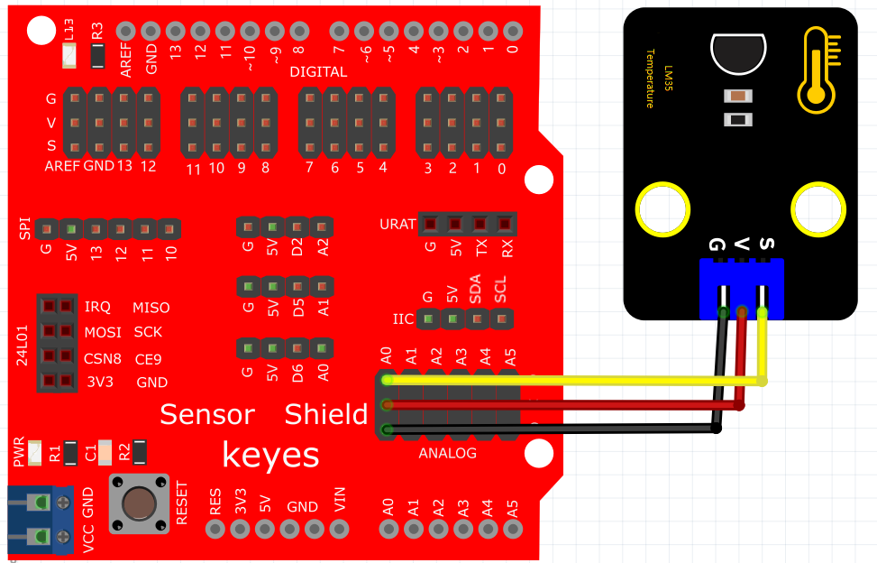
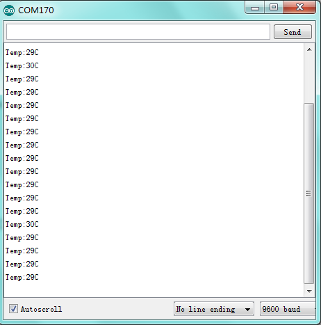

# Arduino


## 1. Arduino简介  

Arduino是一款开源电子原型平台，旨在帮助用户开发互动电子项目。它由硬件和软件组成，硬件包括多种型号的开发板，如Arduino UNO和MEGA，软件则主要是Arduino IDE，用于编写和上传代码。Arduino的编程语言基于C/C++，具有易于学习的语法，非常适合初学者。通过丰富的传感器和模块，Arduino可以实现多种应用，如机器人、智能家居和环境监测等。其广泛的社区支持和丰富的资源使其成为学习和实践电子及编程的理想选择。  

## 2. 连接图  

  

## 3. 测试代码  

```cpp  
void setup() {  
    Serial.begin(9600); // 设置波特率  
}  

void loop() {  
    unsigned int val; // 定义变量val  
    unsigned int dat; // 定义变量dat  

    val = analogRead(A0); // 将val设置为读取到的A0的数值  
    dat = (500 * val) / 1024; // 计算出当前温度数字dat  

    Serial.print("Temp: "); // 显示 Temp:  
    Serial.print(dat); // 显示计算的温度值  
    Serial.println("C"); // 显示C，并自动换行  

    delay(500); // 延迟0.5S  
}  
```  

## 4. 测试结果  

按照上图接好线，烧录好代码，上电后，通电后，串口监视器中将显示当前环境温度值，如下图所示。  




