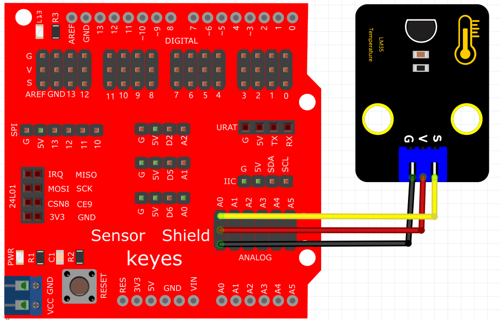
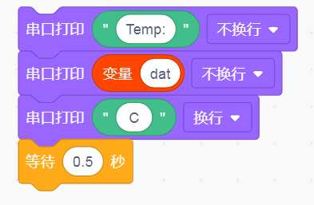

# KidsBlock

## 1. KidsBlock简介  

KidsBlock是一款专为儿童和初学者设计的图形化编程工具，旨在通过友好的用户界面和直观的拖拽式功能，使编程学习变得简单而有趣。它支持多种硬件平台，如Arduino，并通过丰富的模块和项目示例，使学生能够从实践中学习编程和电子技术。KidsBlock强调Creative Coding，鼓励年轻用户发挥创造力，构建互动的电子作品。通过与传感器、执行器等硬件的结合，KidsBlock使学习变得生动且富有趣味。  

## 2. 连接图  

  

## 3. 测试代码  

1. 在事件栏拖出Arduino启动模块；然后在串口栏拖出设置串口波特率模块并设置波特率为9600。  
   
     

2. 在变量栏拖出两个声明全局变量模块，名称分别设置为val，dat，赋值为0。  
   
     

3. 在控制栏拖出重复执行模块。  
   
     

4. 在变量栏拖出设置变量模块并设置名称为val，然后将引脚模块的读取模拟引脚模块添加给val变量模块，并设置引脚为A0。  
   
     

5. 在变量栏拖出设置变量模块并设置名称为dat，先在运算栏拖出除法模块，再拖出乘法模块并放在除法模块的第一个格子里；然后按照这个公式设置好：dat=（500×val）÷1024。  
   
     

6. 在串口栏拖出串口打印模块（不换行），然后在文本栏拖出文本模块并设置文本为“Temp：”。  

7. 在串口栏拖出串口打印模块（不换行），然后在变量栏拖出变量dat。  

8. 在串口栏拖出串口打印模块（不换行），然后在文本栏拖出文本模块并设置文本为“C”。  

9. 控制栏拖出延时模块并设置延时为500ms。  
   
     

## 4. 测试结果  

按照上图接好线，烧录好代码，上电后，通电后，我们可在软件串口监视器中看到当前环境温度值，如下图。  

