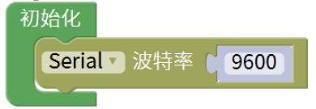
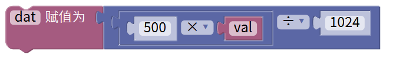
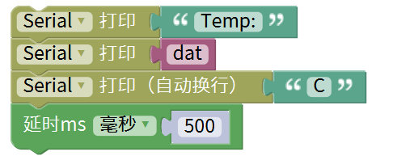
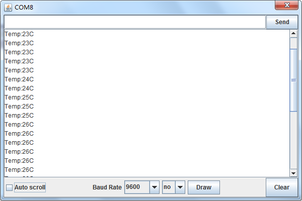

# Mixly

## 1. Mixly简介  

Mixly是一款专为初学者和儿童设计的图形化编程工具，旨在通过简单易懂的界面和拖拽式功能，使编程教育变得生动有趣。它支持Arduino等多种硬件平台，使得用户能够通过结合实际硬件来学习编程和电子知识。Mixly具有丰富的模块库和示例项目，用户可以利用这些资源轻松创建互动应用和硬件项目。该工具强调动手实践，旨在培养学生的创造力和问题解决能力。  

## 2. 连接图  

  

## 3. 测试代码  

1. 在变量栏拖出两个声明变量模块，并设置一个名为dat，另一个为val，赋值为0。  
   
     

2. 在控制栏拖出初始化模块，然后在串口栏拖出设置串口波特率模块并设置为9600。  
   
     

3. 在变量栏里拖出val变量赋值模块；然后在引脚栏拖出模拟输入模块并设置管脚为A0。  
   
     

4. 在变量栏里拖出dat变量赋值模块；然后再数学栏拖出算法模块，一个设置乘（×），一个设置除（÷），除法模块先放在dat模块后面，乘法模块放在除法模块的第一个格子里；设置公式为：dat=（500×val）÷1024。  
   
     

5. 在串口栏拖出串口打印模块，然后在添加文本栏的文本模块并设置文本为“Temp:”。  

6. 在串口栏拖出串口打印模块，然后再添加变量栏的dat变量模块。  

7. 在串口栏拖出串口打印模块，然后在添加文本栏的文本模块并设置文本为“C”。  

8. 在控制栏拖出延时模块并设置延时为500ms。  
   
     

## 4. 测试结果  

按照上图接好线，烧录好代码，上电后，可在软件串口监视器中看到当前环境温度值，如下图所示。  

