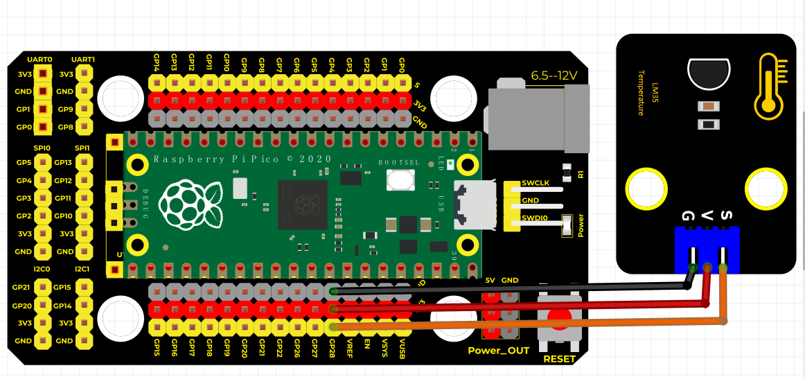
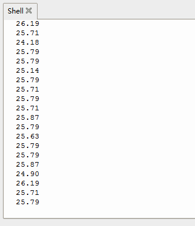

# Python


## 1. Python简介  

Python是一种高级编程语言，具有人性化的语法和丰富的库，适合从初学者到专业开发者的广泛应用场景。它广泛用于网页开发、数据分析、人工智能、机器学习、科学计算等领域。Python的兼容性和跨平台特性使得它在开发中极具灵活性。通过大量的框架和工具，Python能够简化复杂的编程任务，并且活跃的社区支持为学习和开发提供了丰富的资源和帮助。Python的易读性和简洁性，使得它成为了许多教育机构教授编程的首选语言。  

## 2. 连接图  

  

## 3. 测试代码  

```python  
import machine  
import utime  

sensorPin = machine.ADC(28)  # 设置28脚为模拟输入脚  
conversion_factor = 3.3 / (65535)  # 电压转换常数  

while True:  
    reading = sensorPin.read_u16() * conversion_factor  # 获取电压值单位为V  
    temperature = (reading * 1000) / 10  # 根据每10mV为1度计算公式：温度 = （电压值 × 1000） / 10  

    # 我们需要的是mV，所以我们把电压值（V）乘以1000转换成mV  
    print("%.2f" % temperature)  # 保留两位小数打印温度  
    utime.sleep_ms(500)  # 延时500ms  
```  

## 4. 测试结果  

按照上图接好线，烧录好代码后，您可以在串口监视器中看到当前环境温度值，如下图所示。  




